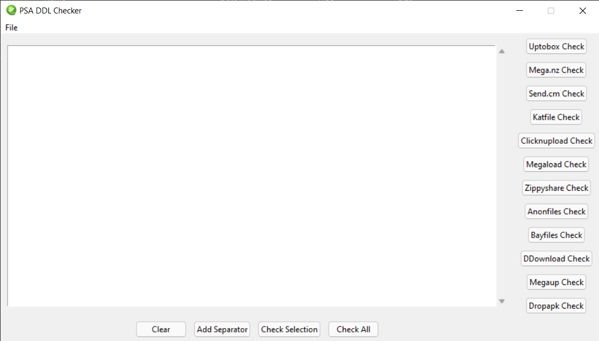
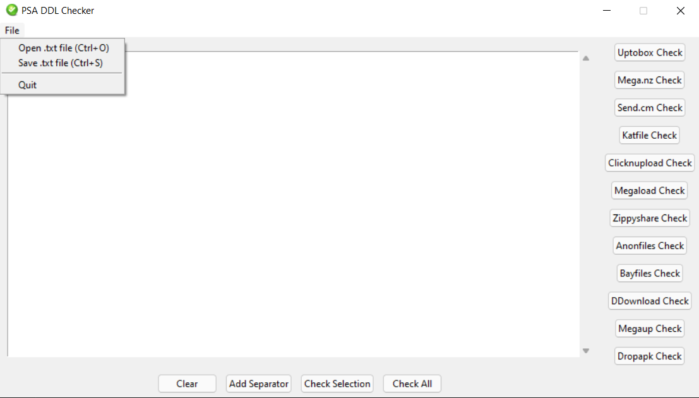
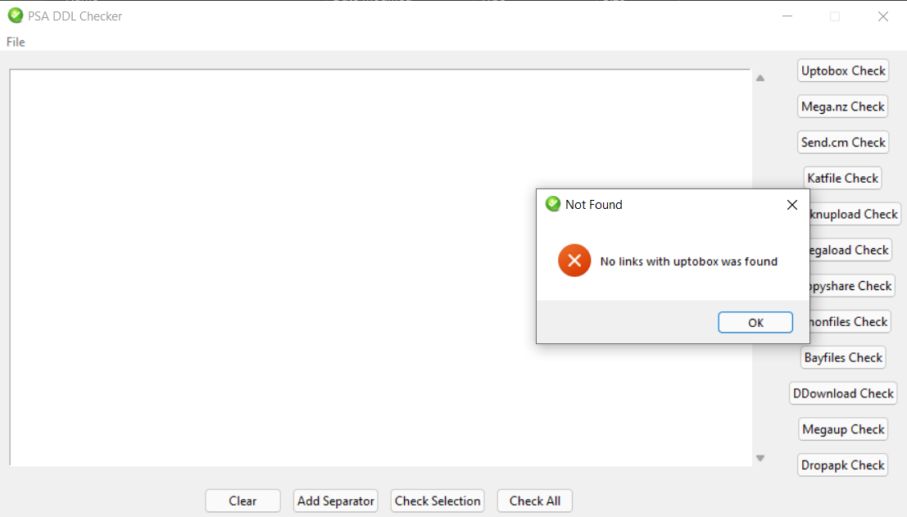
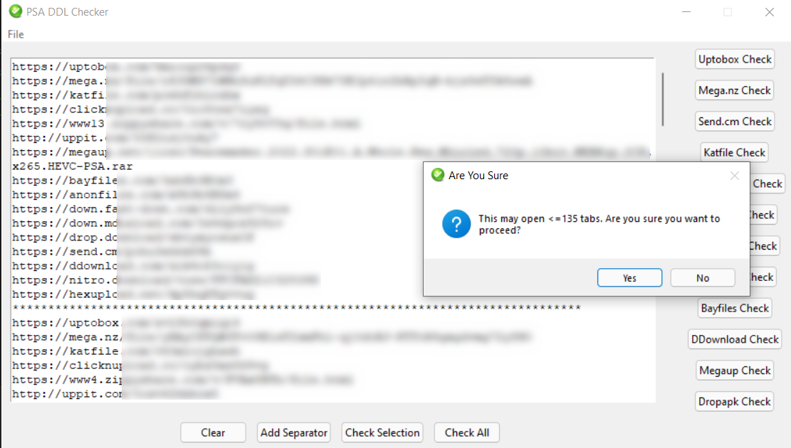

# PSA DDL Checker

Small utility for the checking/opening the direct download liks from PSARips.

## 📥 Download Latest Version:

## 🔧 Features:
- Dedicated buttons for most-used websites. For example, "uptobox" button opens all the uptobox links present in the box.
- Option to open and save .txt files.
- Open all links present in the box at once.
- Open only the selected links.
- Separator button for separating links for different episodes/parts.

## 📷 Screenshots:
### Windows:

### Linux
